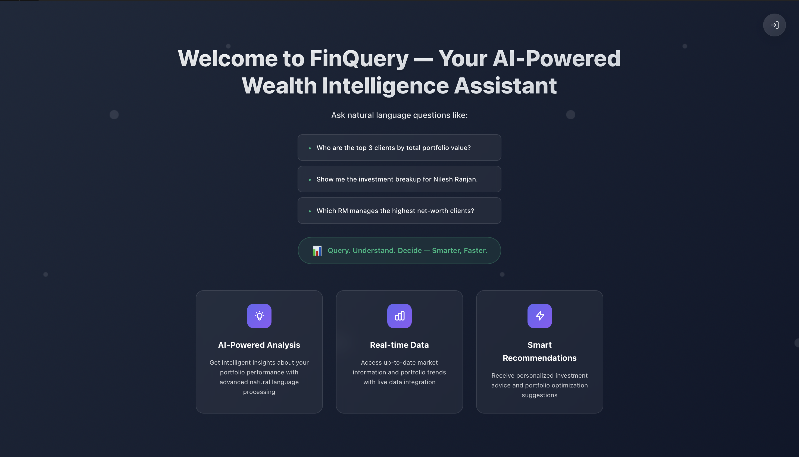
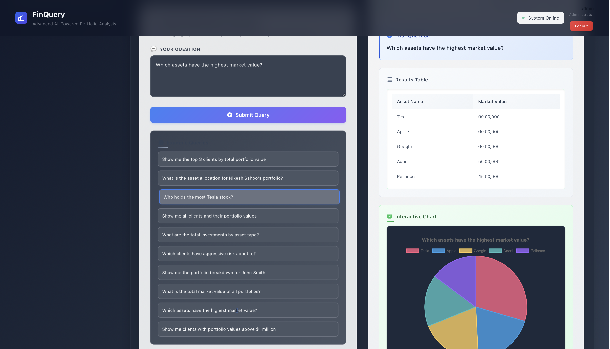
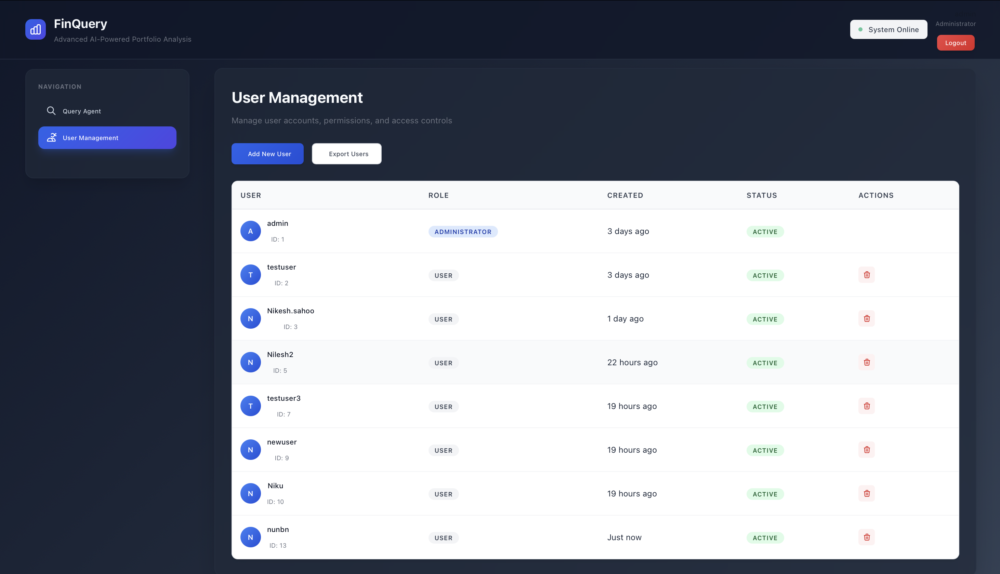

# FinQuery 🧠📊 – Natural Language Financial Query System

**FinQuery** is an AI-powered financial intelligence dashboard designed for wealth management firms. Built as part of the **Valuefy Innovation Lab Intern Technical Assignment**, this system allows business users to query portfolio and investment data using natural language — with responses in text, tables, and charts.

---

## 🌟 Features

- 🔍 Natural Language Query using LangChain RAG
- 💾 SQL-based backend (MySQL)
- 📊 Visual output: tables, graphs, and summaries
- 🔐 JWT-based Authentication
- 🧠 Gemini Pro or Open Source LLM support
- 🌐 ReactJS frontend + FastAPI backend

---

## 🧠 Use Case

> Wealth managers for film stars and sports personalities need instant portfolio insights.  
> FinQuery bridges that gap with natural language + AI-powered responses.

Example queries:

- _“Show me the top 3 clients by portfolio value”_
- _“Which RM handles the highest total investment?”_
- _“Break down Admin’s portfolio by asset”_

---

## 🏗️ System Architecture

```plaintext
+--------------+        +---------------------+       +--------------------+
|   ReactJS    |  --->  |    FastAPI Backend   |  -->  |  SQL (MySQL)       |
|  Frontend UI |        |  (Auth, LangChain)   |       |  (Clients, Portfolios) |
+--------------+        +---------------------+       +--------------------+
                             ↓
                   +------------------+
                   |   LangChain RAG  |
                   |  + Gemini / LLM  |
                   +------------------+
```

## 📸 Preview





## Backend

```bash
cd rag-agent-backend
python -m venv venv
source venv/bin/activate
pip install -r requirements.txt

# Set env variables or .env
uvicorn main:app --reload --port 8000
```

## Frontend

```bash
cd ui
npm install
npm run dev
```

## Future Scope

-Integrate MongoDB for richer client metadata
-Enable voice query with Whisper + Streamlit
-RAG over PDFs and contracts
-Fine-tuned LLMs for financial context
